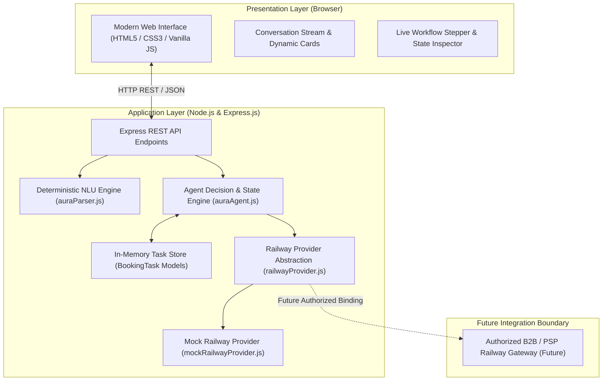

# AURA: Autonomous User Request Agent

> **An autonomous conversational agent prototype for natural-language railway travel requests, multi-turn slot filling, and permitted provider workflow orchestration.**

[](https://nodejs.org/)
[](LICENSE)
[]()
[-brightgreen.svg)]()
[-brightgreen.svg)]()

---

## 1. Project Title
**AURA** — Autonomous User Request Agent (Railway Domain Prototype)

---

## 2. One-Line Description
A conversational AI agent that interprets natural-language railway booking requests, autonomously collects missing parameters through stateful multi-turn dialogues, and coordinates the complete booking lifecycle through a permitted provider architecture.

---

## 3. Problem Statement
Commercial railway booking workflows generally require travelers to navigate complex graphical user interfaces with nested dropdowns, station acronyms, rigid date pickers, and multi-step forms. For everyday users, expressing travel requirements in natural language is vastly simpler. However, automating railway booking conversationally presents three critical challenges:
1. **Ambiguous Natural Language**: Users frequently omit key parameters (such as departure station, travel class, or date).
2. **Regulatory & Policy Compliance**: Public railway reservation websites (such as IRCTC) explicitly prohibit unauthorized scraping, browser automation (Puppeteer, Selenium), credential harvesting, and automated bot logins.
3. **LLM Non-Determinism**: Generic generative language models frequently hallucinate train numbers, invent non-existent schedules, or fail to adhere to rigid state machines.

---

## 4. Proposed Solution
AURA resolves these issues by pairing:
1. A **deterministic rule-based NLU engine** that reliably extracts intents, routes, dates, passengers, and classes without hallucination or third-party cloud costs.
2. A **stateful conversational decision engine** that detects missing information, prompts targeted follow-up questions, and interprets contextual short replies.
3. A **decoupled railway provider abstraction layer** that executes train search, quota verification, fare calculation, and simulated reservations via a policy-compliant `MockRailwayProvider`—ensuring zero unauthorized scraping while preserving a clean path for authorized B2B integration in the future.

---

## 5. Key Capabilities
- **Natural Language Understanding**: Parses complex sentences (e.g. *"Book me a train from Chennai to Coimbatore tomorrow evening for 2 adults in 3AC"*).
- **Multi-Turn Slot Filling**: Proactively prompts for missing attributes (`source`, `destination`, `date`, `passengers`, `class`).
- **Contextual Answer Disambiguation**: Correctly resolves elliptical answers (`"2"`, `"3AC"`, `"Chennai"`) based on the active dialogue context.
- **Interactive Train Selection**: Displays matching express trains with arrival/departure schedules, class options, and live seat availability.
- **Seat Quota & Fare Calculation**: Dynamically verifies seat quotas and computes total fares scaled by passenger count.
- **Digital Boarding Pass Generation**: Produces a structured mock ticket with reference code `AURA-MOCK-XXXXXX`.
- **Live Workflow Inspection**: Real-time visual tracking across a 4-stage stepper, state inspector, and activity timeline.
- **Duplicate Booking Prevention**: Locks confirmed sessions against duplicate booking calls.

---

## 6. System Architecture

AURA is built on a clean four-tier decoupled architecture:



For complete technical specifications, see [`docs/architecture.md`](docs/architecture.md).

---

## 7. Technology Stack
- **Frontend**: HTML5, Modern CSS3 (Custom Properties, Glassmorphism, CSS Grid/Flexbox), Vanilla JavaScript (ES6+). Zero frontend frameworks.
- **Backend**: Node.js (v18+), Express.js (`express: ^4.21.2`). Zero external runtime dependencies.
- **NLU & Agent**: Custom deterministic regex tokenizers and state machine controllers in pure JavaScript.
- **Provider Layer**: Interface-driven simulation service (`mockRailwayProvider.js`).
- **Testing & Benchmarking**: Node.js `assert`, `http`, and `perf_hooks` modules.

---

## 8. AURA Workflow Lifecycle

```text
User Natural Language Request
        │
        ▼
[1. Deterministic NLU] ──► Extracted Entities & Normalized Values
        │
        ▼
[2. Agent Decision Engine] ──► Missing Details? ──► Prompt User & Collect Responses
        │
        ▼
[3. Journey Review] ──► User Confirms Journey Parameters
        │
        ▼
[4. Railway Provider Search] ──► Matching Express Trains (Seeded Routes or Dynamic Fallback)
        │
        ▼
[5. Train Selection & Availability] ──► User Selects Train Number ──► Real-Time Quota Check
        │
        ▼
[6. Booking Preparation] ──► Validates Parameters & Computes Fare
        │
        ▼
[7. Final Booking Review] ──► User Approves Mock Reservation
        │
        ▼
[8. Mock Booking Execution] ──► Issues AURA-MOCK-XXXXXX Reference & Digital Ticket
```

### State Machine Specification
The agent coordinates across two explicit sets of states:
- **Information Collection States**: `collecting_information`, `ready_for_confirmation`, `confirmed`, `cancelled`.
- **Railway Workflow States**: `searching_trains`, `train_selected`, `checking_availability`, `booking_ready`, `booking_in_progress`, `booking_confirmed`, `booking_failed`.

---

## 9. Natural-Language Understanding (NLU)
The NLU service ([`backend/services/auraParser.js`](backend/services/auraParser.js)) provides deterministic, instantaneous parsing without cloud API dependencies:
- **Intent Detection**: Identifies railway booking intents using regex pattern matching.
- **Station Extraction**: Employs positional lookaheads (`from [X] to [Y]`, `to [Y] from [X]`, `to [Y]`, `from [X]`) with boundary punctuation support (`.`, `,`, `!`, `?`).
- **Date Extraction**: Supports relative terms (`today`, `tomorrow`, `day after tomorrow`) and standard calendar formats (e.g. `25th March`, `2026-04-15`).
- **Passenger Extraction**: Recognizes digits and word expressions (`"one"` through `"ten"`, `"for 2 people"`, `"3 adults"`).
- **Class Normalization**: Maps colloquial travel classes to standardized railway codes (`1A`, `2A`, `3A`, `SL`, `CC`, `EC`, `2S`).
- **Time Preference**: Detects morning, afternoon, evening, and night travel preferences.

---

## 10. Stateful Agent Engine
The conversational agent ([`backend/services/auraAgent.js`](backend/services/auraAgent.js)) acts as the workflow orchestrator:
- Manages unique conversational task instances (`BookingTask`).
- Performs missing-field detection and emits targeted prompts (`request_source`, `request_destination`, `request_date`, `request_passengers`, `request_class`).
- Contextually resolves short user answers when awaiting specific fields.
- Preserves full conversation history and state across turns.
- Enforces strict transition validation and handles user cancellations gracefully.

---

## 11. Railway Provider Architecture
AURA defines a strict abstract interface ([`backend/services/railwayProvider.js`](backend/services/railwayProvider.js)) defining five asynchronous/synchronous operations:
1. `searchTrains(criteria)`
2. `selectTrain(taskId, trainNumber)`
3. `checkAvailability(criteria)`
4. `prepareBooking(task)`
5. `book(task)`

This abstraction ensures that the agent logic has zero coupling to the underlying implementation.

---

## 12. Mock Railway Provider
The active provider implementation ([`backend/services/mockRailwayProvider.js`](backend/services/mockRailwayProvider.js)):
- **Seeded Express Routes**: Contains authentic express train corridors (e.g., Chennai $\leftrightarrow$ Coimbatore, Chennai $\leftrightarrow$ Madurai, Chennai $\leftrightarrow$ Bangalore).
- **Algorithmic Fallback Engine**: Dynamically synthesizes plausible express train options for any unseeded station pair within the 25-station lexicon.
- **Dynamic Fares & Quotas**: Computes distance-scaled fares and maintains seat quotas.
- **Reference Generation**: Issues realistic reference codes matching `AURA-MOCK-XXXXXX`.
- **Prominent Simulation Notices**: Attaches explicit disclaimers to all outputs.

---

## 13. API Overview

| Endpoint | Method | Description |
|:---|:---:|:---|
| `/api/analyze` | `POST` | Raw NLU analysis of a natural language string. |
| `/api/agent/message` | `POST` | Main conversational endpoint; processes user text and updates task state. |
| `/api/agent/task/:id` | `GET` | Retrieves full JSON snapshot of an active booking task. |
| `/api/agent/reset` | `POST` | Resets and clears an in-memory task session. |
| `/api/agent/book` | `POST` | Dispatches mock booking execution for an approved task. |
| `/api/trains/search` | `POST` | Queries train options for a source, destination, and date. |
| `/api/trains/select` | `POST` | Binds a selected train to an active task. |
| `/api/trains/availability` | `POST` | Checks real-time seat availability quota. |

---

## 14. Project Structure

```text
D:\AURA\
├── backend/
│   ├── config/
│   │   └── railway.js                   # Provider configuration settings
│   ├── models/
│   │   └── bookingTask.js               # State model for booking tasks
│   ├── routes/
│   │   ├── agent.js                     # Conversational agent API endpoints
│   │   ├── analyze.js                   # NLU analysis API endpoint
│   │   └── trains.js                    # Railway provider API endpoints
│   ├── services/
│   │   ├── auraAgent.js                 # Stateful agent decision engine
│   │   ├── auraParser.js                # Deterministic NLU parser service
│   │   ├── mockRailwayProvider.js       # Simulated mock railway provider
│   │   └── railwayProvider.js           # Abstract provider interface contract
│   └── server.js                        # Express app and route registrations
├── frontend/
│   ├── index.html                       # Two-panel responsive workspace
│   ├── script.js                        # Client-side UI & conversation controller
│   └── style.css                        # Modern dark technical design system
├── tests/
│   ├── evaluation/
│   │   ├── evaluation-report.md         # Detailed 12-section Phase 5 report
│   │   ├── evaluation-results.json      # Machine-readable test execution metrics
│   │   └── test-cases.json              # Deterministic 54-case evaluation dataset
│   ├── phase5/
│   │   ├── agent-evaluation.test.js     # Agent decision engine test suite
│   │   ├── benchmark.test.js            # Latency benchmark suite (100 runs/op)
│   │   ├── end-to-end-evaluation.test.js# 5 full user journey scenarios
│   │   ├── error-evaluation.test.js     # HTTP error handling & security audit
│   │   ├── nlu-evaluation.test.js       # Field-level & complete NLU test suite
│   │   ├── railway-evaluation.test.js   # Railway provider workflow test suite
│   │   └── run-all-evaluations.js       # Master evaluation runner
│   ├── agent.test.js                    # Phase 2 agent unit tests
│   ├── agent_server.test.js             # Phase 2 multi-turn HTTP tests
│   ├── parser.test.js                   # Phase 1 NLU unit tests
│   ├── phase4.test.js                   # Phase 4 provider unit tests
│   ├── phase4_server.test.js            # Phase 4 HTTP integration tests
│   └── server.test.js                   # Phase 1 server integration test
├── docs/
│   ├── architecture.md                  # Comprehensive system architecture document
│   ├── final-project-status.md          # Complete project lifecycle & Git status
│   └── ieee-paper-material.md           # 16-section IEEE research paper material
├── package.json                         # Project metadata and test scripts
└── README.md                            # Main project documentation
```

---

## 15. Installation

### Prerequisites
- [Node.js](https://nodejs.org/) (Version 18.0.0 or higher recommended)
- npm (Version 8.0.0 or higher)

### Setup
```bash
# Clone the repository
git clone https://github.com/karthi-2006-11/AURA-1.0-.git
cd AURA-1.0-

# Install dependencies
npm install
```

---

## 16. Running the Application

### Start the Server
```bash
npm start
```
The server will start on port `3000`:
```text
==================================================
AURA — Autonomous User Request Agent
Server running on http://localhost:3000
Environment: development
Railway Provider: mock (MockRailwayProvider)
==================================================
```
Open your browser and navigate to:
```
http://localhost:3000
```

---

## 17. Automated Testing
Run the complete regression test suite:
```bash
npm test
```
Executes all **37 automated unit and integration tests** across Phases 1 through 4:
```text
Summary: 8/8 Phase 1 Parser tests passed.
--- API INTEGRATION TEST PASSED! ---
Summary: 8/8 Phase 2 Agent tests passed.
--- AGENT HTTP WORKFLOW TEST PASSED! ---
Summary: 12/12 Phase 4 Railway tests passed.
--- ALL PHASE 4 HTTP INTEGRATION TESTS PASSED! ---
```

---

## 18. Empirical Evaluation Results
To execute the comprehensive Phase 5 evaluation suite against the deterministic 54-case dataset:
```bash
node tests/phase5/run-all-evaluations.js
```

### Measured Evaluation Performance

| Evaluation Category | Test Scope | Passed / Total | Accuracy / Success Rate |
|:---|:---|:---:|:---:|
| **NLU Intent Detection** | Classifies booking intent | 32 / 32 | **100.00%** |
| **NLU Source Extraction** | Origin station extraction | 26 / 26 | **100.00%** |
| **NLU Destination Extraction** | Arrival station extraction | 26 / 26 | **100.00%** |
| **NLU Date Extraction** | Relative & calendar dates | 26 / 26 | **100.00%** |
| **NLU Passenger Extraction** | Digits & verbal expressions | 18 / 18 | **100.00%** |
| **NLU Class Normalization** | Travel class codes | 18 / 18 | **100.00%** |
| **NLU Time Preference** | Diurnal preferences | 16 / 16 | **100.00%** |
| **Complete Single-Turn Cases** | Full parameter tuple | 16 / 16 | **100.00%** |
| **Agent Workflows** | Missing fields, context, multi-turn | 26 / 26 | **100.00%** |
| **Railway Workflow Operations** | Search, select, quotas, mock book | 12 / 12 | **100.00%** |
| **HTTP Error Handling** | Bad requests, 404s, 0 stack leaks | 13 / 13 | **100.00%** |
| **End-to-End User Journeys** | 5 complete multi-step flows | 5 / 5 | **100.00%** |
| **Regression Suite** | Pre-existing phase tests | 37 / 37 | **100.00%** |
| **Overall Evaluation Suite** | Comprehensive framework | **72 / 72** | **100.00%** |

*(Note: 100% represents complete pass rate on the curated deterministic test cases and does not imply universal open-domain perfection).*

---

## 19. Local Prototype Performance Benchmark
Latency measured using Node.js `perf_hooks` (100 iterations per operation under local prototype conditions):

| Operation | Iterations | Average Latency | Median Latency | Min Latency | Max Latency |
|:---|:---:|:---:|:---:|:---:|:---:|
| NLU Parsing | 100 | 0.0033 ms | 0.0032 ms | 0.0031 ms | 0.0051 ms |
| Agent Message Dispatch | 100 | 0.0118 ms | 0.0103 ms | 0.0096 ms | 0.0292 ms |
| Train Route Search | 100 | 0.0018 ms | 0.0014 ms | 0.0009 ms | 0.0107 ms |
| Train Selection | 100 | 0.0012 ms | 0.0011 ms | 0.0010 ms | 0.0046 ms |
| Availability Verification | 100 | 0.0012 ms | 0.0009 ms | 0.0009 ms | 0.0089 ms |
| Mock Booking Execution | 100 | 0.0034 ms | 0.0030 ms | 0.0027 ms | 0.0123 ms |
| **Overall Pipeline Benchmark** | **600** | **0.0039 ms** | **0.0034 ms** | **0.0009 ms** | **0.0452 ms** |

> [!NOTE]
> **LOCAL PROTOTYPE PERFORMANCE NOTICE**:
> These measurements represent local in-memory prototype execution on Node.js (v25.8.1). They measure algorithmic and routing efficiency. They do not simulate external internet latency or production railway API roundtrips.

---

## 20. Known Prototype Limitations
1. **Curated Station Lexicon**: Tested across a curated vocabulary of 25 major Indian railway stations. Stations outside this lexicon in ambiguous single-word sentences require explicit context.
2. **Relative-Date Expressions**: Recognizes `"today"`, `"tomorrow"`, and `"day after tomorrow"`, plus explicit dates (e.g. `"25th March"`); complex phrases like `"next weekend"` are not yet parsed.
3. **Simulated Mock Railway Provider**: All train routes, seat availability figures, fares, and reference codes originate in-memory from `MockRailwayProvider`; there is no live connection to IRCTC or external railway reservation servers.
4. **In-Memory Non-Persistent Task Storage**: Session state resides in Node.js process memory without database backing; restarting the server clears active booking tasks.
5. **No Authentication or Authorization**: The prototype has no user accounts, password authentication, or session tokens.
6. **No Payment Processing**: The system performs mock reservations and calculates passenger fares, but does not interface with payment gateways or handle financial transactions.

---

## 21. Future Work
1. **Authorized B2B Railway Integration**: Implementing a live production adapter for the `RailwayProvider` interface connecting to an accredited railway service provider API.
2. **Constrained Small Language Model (SLM)**: Augmenting regex parsing with an embedded SLM for regional station synonyms and flexible date phrasing.
3. **Persistent Distributed Storage**: Replacing in-memory storage with PostgreSQL / Redis and session TTLs.
4. **User Authentication & Payment Gateway**: Introducing OAuth2 user authentication and secure payment gateway integrations (e.g. UPI, cards).
5. **Multi-Lingual Capabilities**: Extending language coverage to Indian regional languages (Tamil, Hindi, Telugu).

---

## 22. Safety & Policy Compliance Boundary

> [!IMPORTANT]
> **Permitted Provider Design (Zero IRCTC Scraping / Browser Automation)**
> - AURA strictly uses an authorized provider abstraction (`RailwayProvider`) designed for permitted B2B / PSP service arrangements.
> - **Strictly Prohibited & Absent**: Web scraping, browser automation (Puppeteer, Playwright, Selenium), private API reverse-engineering, CAPTCHA bypass, credential harvesting, or Tatkal automation against `irctc.co.in`.
> - All railway schedules, availability checks, and booking results in this prototype are deterministically generated by `MockRailwayProvider` for development, demonstration, and evaluation.
> - Every mock output, ticket card, and system response explicitly displays:  
>   `"MOCK RAILWAY PROVIDER • Simulation only — no real railway ticket is booked."`
> - Generated booking references follow the format `AURA-MOCK-XXXXXX`.

---

## 23. Project Status & Git Checkpoints

| Phase | Milestone Name | Commit Hash | Scope & Verification |
|:---:|:---|:---:|:---|
| **Phase 1** | Foundation + Natural-Language Understanding | `b56d92d` | Deterministic NLU parser & API |
| **Phase 2** | AI Agent & Booking Workflow | `357e15e` | Multi-turn agent engine & state persistence |
| **Phase 3** | Premium UI + Live Agent Visualization | *(included in Phase 4)* | Modern technical UI, stepper, inspector |
| **Phase 4** | Permitted Railway Booking Integration | `9051e67` | Mock railway provider & booking simulation |
| **Phase 5** | Testing, Evaluation & Measurement | `8b3d929` | 54-case evaluation suite & benchmarking |
| **Phase 6** | Final Prototype & IEEE Documentation | *(pending final checkpoint)* | Complete technical documentation & IEEE paper material |

For full lifecycle details, refer to [`docs/final-project-status.md`](docs/final-project-status.md).

---

## License
This project is developed for academic, educational, and research evaluation purposes under the MIT License.
