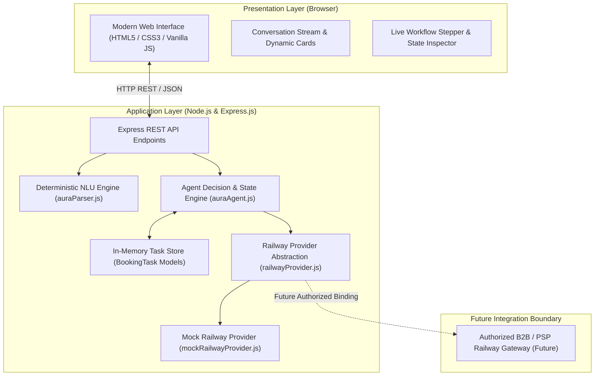
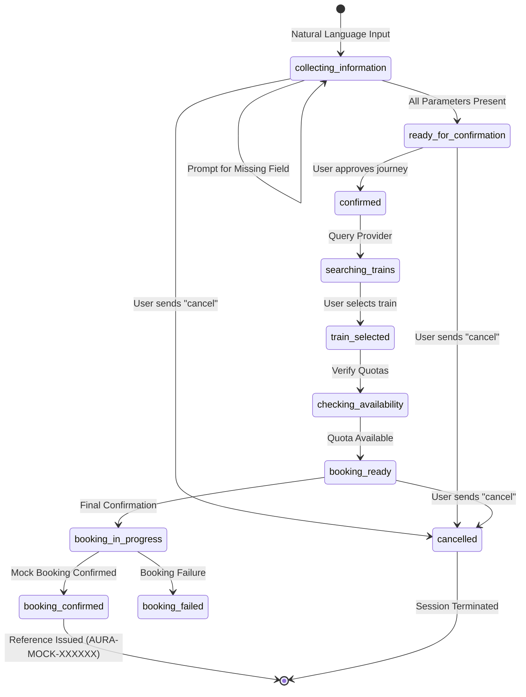

# AURA System Architecture & Design Specification

## 1. High-Level Architecture Overview

AURA (Autonomous User Request Agent) is designed as a modular, decoupled, and stateful conversational agent system tailored for railway travel requests. The architecture strictly separates natural language understanding, conversational state management, and railway domain services.



### Architectural Principles
1. **Separation of Concerns**: NLU parsing is purely functional and stateless; conversation state is encapsulated within domain models (`BookingTask`); railway domain logic is abstracted behind an interface.
2. **Provider Decoupling**: The agent interacts strictly with the `RailwayProvider` abstract interface. It possesses no awareness of whether the provider is simulated or live, facilitating future authorized B2B integration without code rewrites.
3. **Safety & Policy Compliance**: Zero web scraping or unauthorized automation. The system operates strictly within permitted architectural patterns using an explicit mock simulation service for all train search, availability, and booking operations.
4. **Deterministic Predictability**: Core entity extraction, slot filling, and state transitions follow rule-based, test-verifiable algorithms rather than unconstrained black-box models.

---

## 2. Presentation Layer (Frontend)

The presentation layer is implemented entirely in standards-compliant HTML5, CSS3, and Vanilla JavaScript, without third-party frameworks.

### Components
- **Conversation Stream (`chat-stream`)**: Renders user queries, agent conversational responses, structured review summaries, selectable train cards, and final boarding passes.
- **Workflow Stepper (`stage-stepper-card`)**: A 4-stage visual progress tracker illustrating progression:
  1. *Collecting Details* (`collecting_information`)
  2. *Train Search* (`searching_trains`, `confirmed`)
  3. *Final Review* (`train_selected`, `booking_ready`)
  4. *Mock Booking* (`booking_confirmed`)
- **Live Booking State Card (`booking-state-card`)**: A synchronized attribute inspector detailing extracted values (`source`, `destination`, `date`, `time_preference`, `passengers`, `class`, `selected_train`, `total_fare`, `reference`).
- **Activity Timeline (`activity-timeline-card`)**: An event log visualizing micro-actions taken by the agent (e.g., entity extraction, train matching, quota verification).
- **Composer & Contextual Replies**: An intuitive input area featuring keyboard shortcuts (`Enter`, `Shift+Enter`) and dynamically generated contextual quick-reply chips.
- **Mandatory Mock Disclosure Banner**: A persistent top-level banner notifying users that all booking operations are simulations with zero commercial validity.

---

## 3. Application & API Routing Layer

The backend is built with Node.js and Express.js, providing RESTful endpoints with consistent JSON payloads, explicit HTTP status codes, and complete stack-trace sanitization.

### API Endpoints
| Route | Method | Purpose | Key Request Fields | Key Response Fields |
|:---|:---:|:---|:---|:---|
| `/api/analyze` | `POST` | Raw NLU intent & entity extraction | `query` | `intent`, `source`, `destination`, `date`, `passengers`, `class`, `valid`, `missing_fields` |
| `/api/agent/message` | `POST` | Conversational message dispatch & slot filling | `task_id`, `message` | `task_id`, `status`, `next_action`, `booking`, `available_trains`, `selected_train`, `booking_result` |
| `/api/agent/task/:id` | `GET` | Retrieve task state snapshot | URL param `:id` | Full `BookingTask` JSON serialization |
| `/api/agent/reset` | `POST` | Reset/clear task session | `task_id` | `success: true` |
| `/api/agent/book` | `POST` | Direct booking execution on confirmed task | `task_id` | `success`, `booking_result` |
| `/api/trains/search` | `POST` | Query train schedules and fares | `source`, `destination`, `date`, `class`, `passengers` | `success`, `trains: [...]` |
| `/api/trains/select` | `POST` | Bind selected train to task | `task_id`, `train_number` | `success`, `task`, `selected_train` |
| `/api/trains/availability` | `POST` | Query seat availability quota | `task_id` OR `train_number`, `class` | `success`, `availability`, `seats`, `mock: true` |

---

## 4. Natural-Language Understanding (NLU) Layer

Implemented in [`backend/services/auraParser.js`](file:///D:/AURA/backend/services/auraParser.js), the NLU module performs multi-stage deterministic token analysis.

### Processing Pipeline
```text
Raw Text Input
      │
      ▼
1. Preprocessing & Sanitization (casing, whitespace normalization)
      │
      ▼
2. Intent Detection (regex pattern matching for booking keywords & actions)
      │
      ▼
3. Entity Extraction (independent modular extractors)
   ├─ extractStations (positional from...to lookaheads with punctuation boundaries)
   ├─ extractDate (relative dates: today/tomorrow/day-after-tomorrow; explicit calendar dates)
   ├─ extractTimePreference (morning/afternoon/evening/night)
   ├─ extractPassengers (numerical digits & word representations: "two", "3 adults")
   └─ extractClass (standard codes: 1A, 2A, 3A, SL, CC, EC, 2S)
      │
      ▼
4. Validation & Normalization (checks required fields: source, destination, date)
      │
      ▼
5. Human-Readable Synthesis (constructs user-facing verification text)
```

---

## 5. Agent Decision & Task Layer

Implemented in [`backend/services/auraAgent.js`](file:///D:/AURA/backend/services/auraAgent.js) and backed by the [`BookingTask`](file:///D:/AURA/backend/models/bookingTask.js) model.

### Task Management
- **Task Lifecycle**: Each user request is associated with an in-memory `BookingTask` identified by a unique ID (`task_<timestamp>_<random>`).
- **Slot Filling Engine**: When mandatory fields (`source`, `destination`, `date`, `passengers`, `class`) are missing, the agent calculates the missing field set and generates a targeted follow-up question.
- **Contextual Answer Disambiguation**: When the agent is waiting for a specific missing field (e.g. `request_passengers`), short elliptical inputs (e.g., `"2"`, `"3AC"`, `"Chennai"`) are resolved directly to the active slot without requiring full sentence grammar.
- **Session Persistence**: Prior turn attributes are preserved across turns, enabling progressive conversation.

---

## 6. Actual Implemented State Machine

The agent operates across two coordinated sets of state machine states:

### A. Information Collection States
- `collecting_information`: Initial state; agent is actively extracting parameters or prompting for missing fields.
- `ready_for_confirmation`: All journey parameters are collected; awaiting user review and approval.
- `confirmed`: User has approved the journey parameters; triggers train search.
- `cancelled`: User explicitly aborted or cancelled the request; workflow terminates.

### B. Railway Workflow States
- `searching_trains`: Search operation dispatched to the railway provider.
- `train_selected`: User has selected a specific train option from the returned list.
- `checking_availability`: Provider verifies real-time seat quota.
- `booking_ready`: Train selected, availability verified, and total fare calculated; awaiting final user booking confirmation.
- `booking_in_progress`: Booking request in flight to the provider.
- `booking_confirmed`: Mock booking successfully transacted; reference code issued; workflow locked against duplicates.
- `booking_failed`: Booking was rejected or failed due to quota exhaustion or validation failure.



---

## 7. Railway Provider Abstraction & Mock Implementation

### Abstract Provider Interface (`railwayProvider.js`)
Defines the required asynchronous/synchronous contract for railway integrations:
- `searchTrains(criteria)`
- `selectTrain(taskId, trainNumber)`
- `checkAvailability(criteria)`
- `prepareBooking(task)`
- `book(task)`

### Separation Rationale
The agent depends exclusively on the `RailwayProvider` interface methods. By decoupling the agent workflow from any specific railway backend:
1. The prototype can run self-contained using `MockRailwayProvider` without external network dependencies.
2. An authorized B2B / PSP service provider can be plugged in during future phases by implementing the same interface, requiring zero alterations to the agent decision engine, NLU parser, or user interface.
3. Strict adherence to legal and railway security guidelines is guaranteed.

### Mock Railway Provider (`mockRailwayProvider.js`)
- **Seeded Routes**: Pre-configured with major Indian railway corridors (Chennai, Coimbatore, Bangalore, Madurai, Delhi, Mumbai).
- **Algorithmic Fallback Generator**: Automatically synthesizes realistic, scheduled express train options for any unseeded station pair within the 25-station lexicon.
- **Seat Quotas & Fares**: Calculates distance-scaled base fares and assigns dynamic seat availability quotas.
- **Disclaimers & Formatting**: Issues mock references matching `AURA-MOCK-XXXXXX` and appends mandatory simulation disclaimers to all outputs.

---

## 8. Complete End-to-End Booking Data Flow

```text
User Natural Language Input
        │
        ▼
[ auraParser.analyzeRequest ]
        │
        ▼ (Structured Parameters)
[ auraAgent.processAgentMessage ] ──> Updates BookingTask in Memory
        │
        ├─► Missing Details? ──> Emit Follow-up Action (request_source, etc.)
        │
        └─► Complete? ──> Status: ready_for_confirmation
                                │
                                ▼ (User confirms parameters: "yes" / "confirm")
                      Status: confirmed
                                │
                                ▼
                      [ mockRailwayProvider.searchTrainsSync ]
                                │
                                ▼ (Presents Available Train Options)
                      User Selects Train Number (e.g., "12673")
                                │
                                ▼
                      Status: train_selected ──► checkAvailabilitySync
                                │
                                ▼
                      Status: booking_ready (Fare computed, seat reserved in quota)
                                │
                                ▼ (User gives final booking confirmation)
                      [ mockRailwayProvider.bookSync ]
                                │
                                ▼
                      Status: booking_confirmed
                      Generated: AURA-MOCK-XXXXXX
                      Displayed: Digital Boarding Pass with Mock Disclaimer
```

---

## 9. Test & Evaluation Layer

The project maintains two distinct testing and measurement suites:

1. **Regression Test Suite (`tests/`)**:
   - `parser.test.js`: 8 unit tests covering NLU entity extraction and edge cases.
   - `server.test.js`: HTTP integration test for `/api/analyze`.
   - `agent.test.js`: 8 unit tests covering multi-turn agent transitions.
   - `agent_server.test.js`: HTTP integration test for multi-turn agent conversations.
   - `phase4.test.js`: 12 unit tests verifying railway provider operations.
   - `phase4_server.test.js`: 7 HTTP integration tests for railway endpoints.
   - *Total*: **37/37 tests passing (100%)**.

2. **Phase 5 Evaluation Suite (`tests/phase5/` & `tests/evaluation/`)**:
   - `test-cases.json`: Deterministic evaluation dataset with 54 structured cases across 5 categories.
   - `nlu-evaluation.test.js`: Field-level and full-tuple NLU accuracy measurement.
   - `agent-evaluation.test.js`: Workflow success rate across 26 distinct agent scenarios.
   - `railway-evaluation.test.js`: 12 functional provider compliance tests.
   - `error-evaluation.test.js`: 13 HTTP negative tests verifying robustness and stack trace isolation.
   - `end-to-end-evaluation.test.js`: 5 complete end-to-end user journey scenarios.
   - `benchmark.test.js`: Sub-millisecond latency measurement using Node.js `perf_hooks` (100 iterations/op).
   - `run-all-evaluations.js`: Master evaluation runner.
   - *Total*: **72/72 evaluation cases passing (100%)**.
